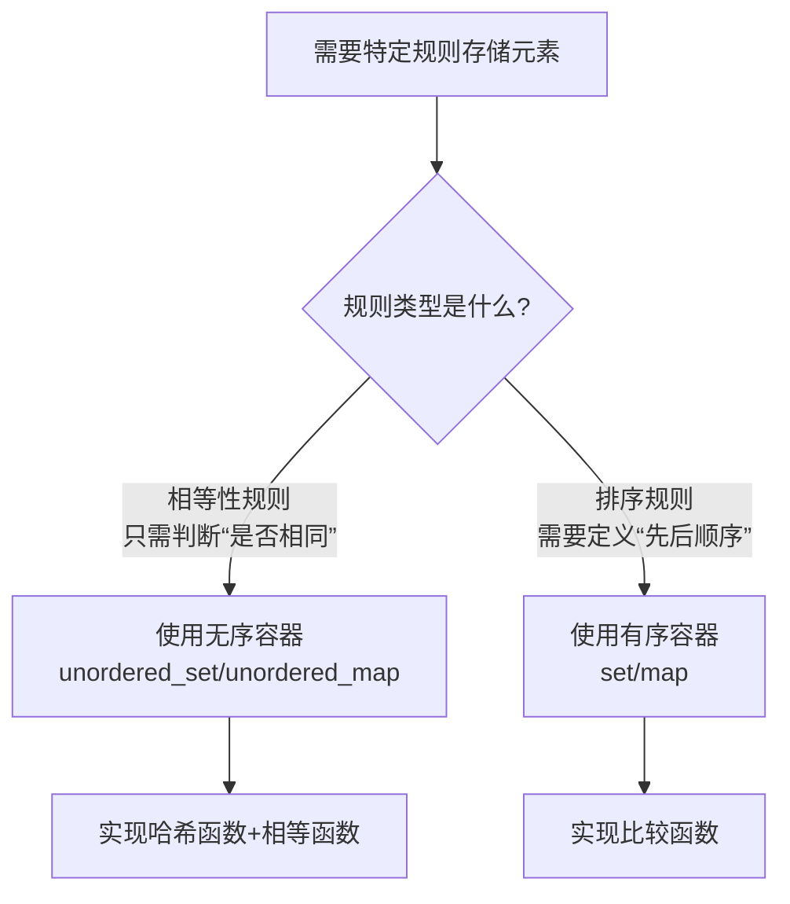

# 无序容器与有序容器的选择指南

## 核心结论

> **选择容器取决于规则类型**：
> - **无序容器**（如 `unordered_set`, `unordered_map`）适合 **"相等性"规则**
> - **有序容器**（如 `set`, `map`）适合 **"排序"规则**

---

## 一、无序容器的适用场景

### 1. 规则特点
- **规则类型**：只需定义 **"何时两个元素相等"**
- **可自定义**：通过以下函数表达规则：
  - **哈希函数**：确定元素在哈希表中的位置
  - **相等比较函数**：判断元素是否等价
- **不关心顺序**：元素存储顺序无关紧要
- **注意**：哈希函数(hash function) 将给定类型的值映射到整形(sizet)值的函数。相等的值必须映射到相同的整数: 不相等的值应尽可能映射到不同整数。

### 2. 典型使用场景
- **自定义去重**：例如 ISBN 相同的书视为同一本书
- **快速键值查找**：如电话簿（名字→号码）
- **分组统计**：按自定义类别分组计数
- **缓存实现**：需要 O(1) 复杂度的快速访问

### 3. 代码示例
```cpp
// 自定义规则：字符串长度相等即视为"相同"
struct LengthHash {
    size_t operator()(const string& s) const {
        return s.size();
    }
};

struct LengthEqual {
    bool operator()(const string& a, const string& b) const {
        return a.size() == b.size();
    }
};

unordered_set<string, LengthHash, LengthEqual> length_set;
```
> 此时 `"apple"` 和 `"table"` 被视为相同（长度均为5）

---

## 二、有序容器的适用场景

### 1. 规则特点
- **规则类型**：需要定义 **"元素间的顺序关系"**
- **必须实现**：严格弱序比较函数（如 `<` 运算符）
- **保持顺序**：元素始终按规则排序存储

### 2. 典型使用场景
- **范围查询**：如查找价格在$100-$200的商品
- **顺序遍历**：如按字母顺序输出字典
- **最近邻搜索**：如查找最接近的时间点
- **需要有序性**：如事件调度系统

### 3. 代码示例
```cpp
// 自定义排序：按字符串长度排序
struct LengthCompare {
    bool operator()(const string& a, const string& b) const {
        return a.size() < b.size(); // 长度升序
    }
};

set<string, LengthCompare> ordered_set;
```
> 此时 `"a"`（长度1）排在 `"bb"`（长度2）前面

---

## 三、关键对比

| **特性**               | **无序容器**                     | **有序容器**                   |
|------------------------|----------------------------------|--------------------------------|
| **核心规则**           | 相等性 (==)                     | 排序 (<, >)                   |
| **底层实现**           | 哈希表                           | 红黑树/平衡二叉搜索树          |
| **查找复杂度**         | 平均 O(1)，最坏 O(n)            | 稳定 O(log n)                  |
| **插入/删除复杂度**    | 平均 O(1)，最坏 O(n)            | O(log n)                      |
| **内存占用**           | 通常较高（桶+链表）             | 通常较低                       |
| **顺序保证**           | 无顺序                           | 始终有序                       |
| **范围查询效率**       | 低效                             | 高效 (O(log n + k))           |
| **自定义规则要求**     | 哈希函数 + 相等函数             | 比较函数                       |

---

## 四、决策流程图



---

## 五、总结指南

1. **用无序容器当**：
   - 只需定义 **"相等"** 概念
   - 需要 **O(1) 平均访问速度**
   - 不关心元素顺序
   - 规则能通过 **哈希+相等函数** 表达

2. **用有序容器当**：
   - 需要定义 **"顺序"** 关系
   - 需要 **范围查询** 或 **有序遍历**
   - 接受 O(log n) 访问速度
   - 规则能通过 **比较函数** 表达

> **最终建议**：  
> 先明确你的核心规则是 **"相等"** 还是 **"排序"**，  
> 再根据性能需求和功能要求选择合适容器。